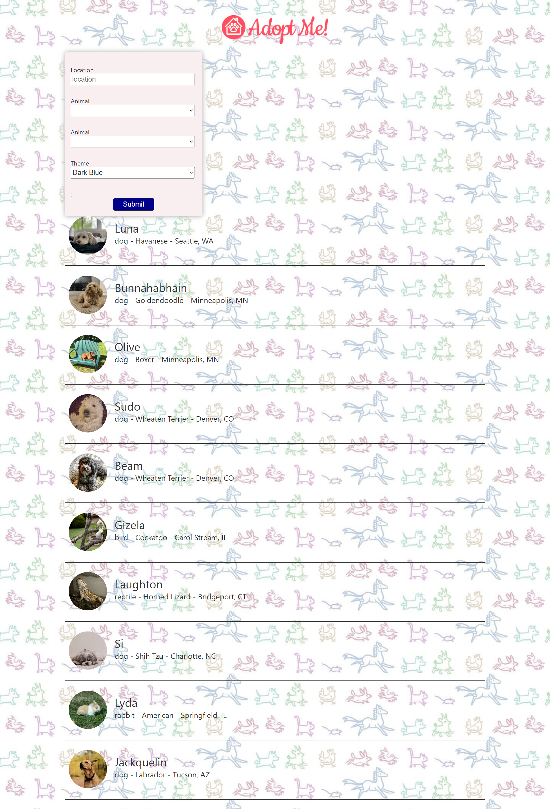

# ADOPT ME

This is a project from Frontend Master's Complete Intro to React V7 course I took recently as a refresher.

## Table of contents

- [Overview](#overview)
  - [Functionalities](#functionalities)
  - [Screenshot](#screenshot)
- [My process](#my-process)
  - [Built with](#built-with)
  - [What I learned](#what-i-learned)
  - [Continued development](#continued-development)
  - [Useful resources](#useful-resources)
- [Setup](#setup)

## Overview

### Functionalities

Users should be able to:

- See a list of list Animals for Adoption
- See hover states for all interactive elements on the page
- Search for different animal and thier respective breeds
- See relevant user information based on their search
- Switch between themes colors for buttons

### Screenshot

## My process

### Built with

- Semantic HTML5 markup
- CSS custom properties
- Flexbox
- CSS Grid
- Mobile-first workflow
- [React](https://reactjs.org/) - JS library

### What I learned

- How to set up Prettier in a project, previously i knew how to setup Prettier on just VSCode
- How to set up Eslint in a project
- How to create a react project from scartch
- How module bundlers work i.e Parcel
- Building for Production
- Error Boundaries
- Portals & useRef for Modals

### Continued development

- Use better API
- Implement Pagination
- Change Design

### Useful resources

- [Course Website](https://btholt.github.io/complete-intro-to-react-v7/)

### Setup

To setup project locally:

- run `npm install` then `npm run dev`
